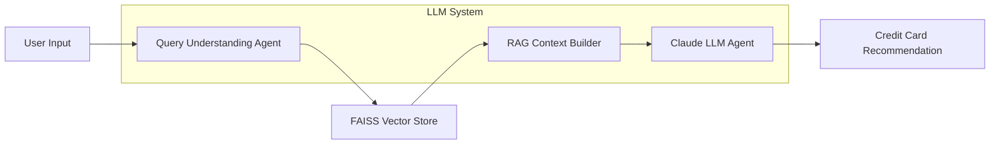

# Hi there 👋, I'm Anish Wadkar

🚀 **Data Engineer | MS in Data Science @ Indiana University Bloomington**  
I work on building **reliable, analytics-ready data pipelines** that transform raw data into insights for decision-making. My interests lie at the intersection of **ETL/ELT, data modeling, workflow orchestration, and BI analytics**, with hands-on experience across healthcare, finance, and product analytics.

---

## 🔧 Technical Skills

**Data Engineering**
- ETL / ELT Pipelines, Batch Processing, Workflow Orchestration  
- Data Pipeline Design, Data Quality Validation, Analytics-Ready Tables  

**SQL & Data Modeling**
- Advanced SQL (Joins, Aggregations, Window Functions)  
- Relational Modeling, Star Schemas, Metric Definitions  

**Orchestration & Transformation**
- Apache Airflow, dbt, SQL-based transformations  

**Cloud & Data Platforms**
- AWS (S3, EC2, Glue, QuickSight)  
- PostgreSQL, MySQL, Snowflake, MongoDB  

**Programming**
- Python, PySpark, R, Bash  

**BI & Analytics**
- Power BI, DAX, Tableau (fundamentals), Dashboard Design  

---

## 💼 Experience Highlights

### 🌍 Global Health Impact (GHI) — Data Intern
- Work with global health datasets from **WHO, GBD, and partner sources**, standardizing country-level indicators across disease models.
- Compute and validate public-health metrics such as **DALYs, incidence, prevalence, and treatment coverage**.
- Support automation of disease models by transitioning manual data collection into **reproducible CSV-based pipelines** with documented validation steps.

### 🤖 Hera Solutions — ML Systems Intern
- Built **Streamlit dashboards** to monitor recommender system performance (Precision@10, NDCG, AUC-ROC).
- Wrote optimized **SQL queries** for metric computation and data validation, supporting recurring analytics reports.
- Partnered with cross-functional teams on **A/B testing dashboards**, improving experimentation decisions by 40%.

---

## 📂 Featured Projects

### 💊 **Pharma Sales Lakehouse**
**BI Analytics & Reporting Solution (dbt, PostgreSQL, Python, Power BI)**  
- Built analytics-ready datasets and structured schemas for operational and financial reporting.
- Developed Power BI dashboards translating sales and regional performance into actionable insights.
- Reduced reporting turnaround time from **days to hours** through automated transformations.

---

### 📈 **Finance Data Warehouse Pipeline**
**Automated Reporting Solution (Apache Airflow, PostgreSQL, Python, Docker)**  
- Built automated ETL pipelines processing **5,000+ financial records every 6 hours**.
- Implemented relational schemas and data quality checks (row counts, null validation, freshness monitoring).
- Improved reporting reliability and stakeholder trust in analytics outputs.

---

### 💳 **CARD IQ — AI-Powered Credit Card Recommender**
**LLM-Backed Recommendation System (Python, Claude LLMs, RAG, FAISS, LangChain)**  
- Built an AI-powered recommender using **multi-agent LLM workflows** and retrieval-augmented generation.
- Analyzed user spending patterns to recommend optimal credit cards from **25+ options**, achieving ~90% recommendation accuracy.
- Designed a scalable RAG pipeline with FAISS vector search, delivering personalized recommendations in under 30 seconds.

---

## 🌱 Currently Learning
- Advanced **Data Platform Architecture & System Design**
- **Cloud-native analytics** and scalable pipeline patterns
- Improving **CI/CD workflows** for data engineering projects

---

## 📫 Connect With Me
- 🔗 [LinkedIn](https://linkedin.com/in/anish-wadkar-a37919211)
- 💻 [GitHub](https://github.com/Aniwadkar)
- 📧 anish.wadkar17@gmail.com

---

⭐ *“Good data pipelines don’t just move data — they build trust in decisions.”*

